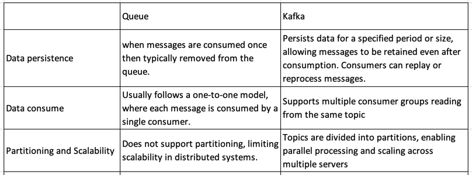

**Kafka:**  
- is a highly organized distributed messaging system based on publish-subscribe methodology.
- Producers input data into Kafka topics, while consumers retrieve this data from those topics. Kafka topics can be partitioned, enabling the parallel processing of data, and topics can be replicated across multiple brokers for fault tolerance.
- It is excellent for handling large volumes of data, making sure messages get where they need to go, and keeping track of what's been sent and received. 
- Use cases:
  1. Real time stream processing like Log Aggregation
  2. Metrics and monitoring.
  3. Event driven architectures like microservices communication.

**Key Terminology:**
1. **Record:** Record in Kafka is the data and is in form of key-value pair. Each record in Kafka consists of a key, a value, and optional metadata.
2. **Topics:** Categories where records are stored. Think of them as a folder name containing related files, where the folders represent topics and the files within them signify individual records.
   - A topic is appended only: When a new event message is written to a topic, the message is appended to the end of the log.
   - Events in the topic are immutable, meaning they cannot be modified after they are written.
   - Events in a topic can be read as often as needed, and events are not deleted after they are consumed. Instead, topics can be configured to expire data after it has reached a certain age or when the topic has reached a certain size.
3. **Brokers:** A kafka server that manages one or more Kafka topics. A Kafka cluster is typically comprised of several brokers. 
   Every broker in a cluster is also a bootstrap server, meaning if you can connect to one broker, you can connect to every broker.
4. **Partitions:** Topics are broken up into partitions, Each partition is like a separate section of a topic's log, and these sections are stored on different brokers.
5. **Offset:** A unique identifier given to each message as it arrives at a partition. It represents the position of a consumer in the partition. It's like a bookmark in a book, marking the last page you've read so that you can pick up from there the next time you open it.
6. **Producers:** Producers are clients that write events to Kafka topics.
   The producer specifies the topics they will write to and the producer controls how events are assigned to partitions within a topic. This can be done in a round-robin fashion for load balancing or via event key.
7. **Consumers:** Consumers are clients that read events from Kafka topics.
   The only metadata retained on a per-consumer basis is the offset or position of that consumer in a topic. This offset is controlled by the consumer. Normally a consumer will advance its offset linearly as it reads records.
8. **Consumer Group:** set of consumers that work together to consume data from one or more Kafka topics. Each message published to a topic is delivered to one consumer instance within each consumer group.
9. **Replication:** Copies of partitions across multiple brokers to ensure fault tolerance and highly available. A common production setting is a replication factor of 3, meaning there will always be three copies of your data.
10. **ZooKeeper:** Originally a crucial part of Kafka's coordination, ZooKeeper helped manage and maintain Kafka brokers, topics, and other metadata. In later versions, ZooKeeper is deprecated and Apache Kafka® Raft (**KRaft**) was introduced into Kafka itself for metadata management.

**Kafka Connect:**
Kafka Connect is like a bridge that helps connect Kafka with other systems easily. It's a framework within Kafka that helps us to define connectors to simplify the process of getting data in and out of Kafka without a lot of custom code.

**Kafka Streams:**
Kafka Streams is a powerful library in Kafka that allows you to process and manipulate data directly within Kafka. It's like a toolbox for building real-time applications that can read from Kafka topics, perform operations like filtering or transformations on the data, and then write the results back to other Kafka topics. Essentially, it helps developers create and run real-time data processing applications without needing separate infrastructure.
For example, a ride-share application might take in input streams of drivers and customers, and output a stream of rides currently taking place.

**How is Kafka different from a queue?**  


**How is Kafka just a append only log file?**  
Kafka organizes data into immutable, ordered sequences of records called "logs". These logs are append-only, meaning once written, data cannot be modified or deleted. New data is continually appended to the end of these logs. It helps in achieving the sequential I/O operation.

**Why does Kafka scale?**  
Below are main design decision that helps kafka scale:
1. Partitioning - It enables parallel processing of data, horizontal scaling and distributing load across multiple brokers.
2. Distributed architecture - multiple brokers are managed by kafka cluster.
3. Replication - Kafka replicates partitions across brokers, providing fault tolerance.
4. Producer and Consumer Parallelism - provides high throughput.
5. Producers and Consumers decoupling - enables high scalability.

**Why does it store data indefinitely?**  
Kafka stores the data as per defined data retention policy. By default, it is 7 days but it can be setup for long or indefinite period.

Reasons:
1. Reprocessing or analyzing historical data.
2. Long-term data retention for analytics.
3. Extended periods serves as a backup for disaster recovery.
4. Consumers can catch up on missed or delayed data without losing valuable information.

**Why does consumers not pop but instead use offsets to read from Kafka?**  
1. Offsets allow consumers to control the exact point in the partition from which they want to read, enabling flexibility. 
2. Consumers can commit offsets after processing messages, ensuring that even if a consumer crashes or restarts, it can resume reading from the last committed offset. 
3. Offsets enable multiple consumers. 
4. Offsets help maintain message order within a partition.  
- Overall, using offsets offers greater control, fault tolerance, scalability, and flexibility compared to traditional queue-based systems.

**Why does Kafka have partitions?**  
1. Scalability: Partitions distribute data across brokers for parallel processing.
2. High Throughput: Handles large data volumes with multiple simultaneous reads and writes.
3. Fault Tolerance: Replicates partitions, ensuring data availability even if a broker fails.
4. Ordered Processing: Maintains message sequence within each partition for accurate processing.
5. Load Balancing: Evenly distributes data across brokers, preventing performance bottlenecks.
6. Concurrent Consumers: Supports multiple consumers reading different partitions simultaneously.
7. Horizontal Scaling: Accommodates increased data by adding partitions without compromising performance.

**How do messages work in Partitions?**  
Kafka uses below partitioning strategy to determine in which partition a message should be placed in:
1. Direct Partition Assignment
    - Producer can assign a record explicitly to a particular partition, then its producer responsibility to ensure records are equally distributed across partitions.
2. Partitioning by Kafka Key
    - 	Producers can assign key to message, allowing Kafka to hash the key (uses murmur2 hashing) and determine the destination partition. Keeping related messages in the same partition maintains order. Using unique keys balances message distribution across partitions.
3. Round-robin Partitioning
    - If a message has no key then it will be distributed in round-robin way among all the topic’s partitions.

**How many consumers can be made given X partitions? Degree of Parallelism?**  
Ideally, each partition should be consumed by a separate consumer in a consumer group for optimal parallel processing.
- We can have more consumers than partitions in a consumer group but consumers will be idle as they won't have partitions to process.
- When consumers are less than partitions then some consumer will be reading from multiple partitions and thus losing the ability to handle partitions concurrently. Hence, not utilizing the parallel processing capabilities of kafka, leading to uneven workloads and causing delays in processing real time data.

**Kafka implementation:**  
1. Download Kafka: https://kafka.apache.org/downloads
2. Kafka with Kraft:  
   a. Open terminal, Generate a Cluster UUID
   $ KAFKA_CLUSTER_ID="$(bin/kafka-storage.sh random-uuid)"

   b. Format Log Directories
   $ bin/kafka-storage.sh format -t $KAFKA_CLUSTER_ID -c config/kraft/server.properties

   c. Start the Kafka Server
   $ bin/kafka-server-start.sh config/kraft/server.properties
   Once the Kafka server has successfully launched, you will have a basic Kafka environment running and ready to use.  
---- OR Follow this link https://kafka.apache.org/quickstart for above point----
3. Let's start, Use https://start.spring.io/ to build Spring boot project with below configuration:
   - Maven Project
   - Jar packaging
   - Java 17
   - Dependencies:
        -	Spring Web
        -	Spring for Apache Kafka
        -	Lombok
        -	DevTools

-> Import this project in intelliJ.

1. Use below properties in application.properties file
    ```
    # To define local kafka server url
    kafka.bootstrap-servers=localhost:9092
    
    #topic name on which message will be sent
    kafka.advance-topic-name=demoTopic
    
    #Consumer group id
    kafka.group-id=myGroup
    
    #No. of messages to be sent for each message publish
    kafka.message-per-api-request=3
    ```
2. Define the payload - "MessageBody" class:
    ```
    @Data
    @AllArgsConstructor
    @NoArgsConstructor
    public class MessageBody {
    int id;
    String message;
    }
    ```
3. Create class 'KafkaConfig':
   - We will define a KafkaTemplate having producer configs and 2 'ConcurrentKafkaListenerContainerFactory' with value deserializer as String and Json Object. 
   ```
   @Configuration
    public class KafkaConfig {
    
        //Topic config
        @Value("${kafka.advance-topic-name}")
        public String topicName;
    
        @Value("${kafka.group-id}")
        public String groupId;
    
        @Value("${kafka.bootstrap-servers}")
        public String bootstrapServers;
    
        /*
        We are instructing the Kafka’s AdminClient bean (already in the context)
        to create a topic with the given configuration.
         */
        @Bean
        public NewTopic demoAdvanceTopic() {
            return TopicBuilder.name(topicName)
                    .partitions(3)
                    .build();
        }
    
        /*
        Producer configs-
           The Producer Configuration is a simple key-value map.
         */
        @Bean
        public ProducerFactory<String, Object> producerFactory() {
            Map<String, Object> props = new HashMap<>();
            props.put(ProducerConfig.BOOTSTRAP_SERVERS_CONFIG, bootstrapServers);
            return new DefaultKafkaProducerFactory<>(props, new StringSerializer(), new JsonSerializer<>());
        }
    
        //kafkaTemplate to send messages to Kafka
        @Bean
        public KafkaTemplate<String, Object> kafkaTemplate(ProducerFactory<String, Object> producerFactory) {
            return new KafkaTemplate<>(producerFactory);
        }
    
        //Object Consumer config
        @Bean
        public ConsumerFactory<String, Object> objectConsumerFactory() {
            JsonDeserializer<Object> jsonDeserializer = new JsonDeserializer<>();
            //To trust all packages while deserializing
            jsonDeserializer.addTrustedPackages("*");
            Map<String, Object> props = new HashMap<>();
            props.put(ConsumerConfig.BOOTSTRAP_SERVERS_CONFIG, bootstrapServers);
            props.put(ConsumerConfig.GROUP_ID_CONFIG, groupId);
            //means that the consumers will start reading messages from the earliest one available when there is no existing offset for that consumer.
            props.put(ConsumerConfig.AUTO_OFFSET_RESET_CONFIG, "earliest");
            return new DefaultKafkaConsumerFactory<>(props, new StringDeserializer(), jsonDeserializer);
        }
    
        @Bean
        public ConcurrentKafkaListenerContainerFactory<String, Object> objectKafkaListenerContainerFactory(ConsumerFactory<String, Object> objectConsumerFactory) {
            ConcurrentKafkaListenerContainerFactory<String, Object> factory = new ConcurrentKafkaListenerContainerFactory<>();
            factory.setConsumerFactory(objectConsumerFactory);
            return factory;
        }
    
        //String consumer config
        @Bean
        public ConsumerFactory<String, String> stringConsumerFactory() {
            Map<String, Object> props = new HashMap<>();
            props.put(ConsumerConfig.BOOTSTRAP_SERVERS_CONFIG, bootstrapServers);
            props.put(ConsumerConfig.GROUP_ID_CONFIG, groupId);
            props.put(ConsumerConfig.AUTO_OFFSET_RESET_CONFIG, "earliest");
            return new DefaultKafkaConsumerFactory<>(props, new StringDeserializer(), new StringDeserializer());
        }
    
        @Bean
        public ConcurrentKafkaListenerContainerFactory<String, String> stringKafkaListenerContainerFactory(ConsumerFactory<String, String> stringConsumerFactory) {
            ConcurrentKafkaListenerContainerFactory<String, String> factory = new ConcurrentKafkaListenerContainerFactory<>();
            factory.setConsumerFactory(stringConsumerFactory);
            return factory;
        }
    }     
    ```
4. Create 'KafkaProducer' service:
    ```
    @Service
    public class KafkaProducer {
    
        @Value("${kafka.advance-topic-name}")
        String topicName;
    
        @Autowired
        KafkaTemplate<String, Object> kafkaTemplate;
    
        @Value("${kafka.message-per-api-request}")
        int messagePerApiRequest;
    
        public String publish(@PathVariable String message) {
            for (int key = 0; key < messagePerApiRequest; key++) {
                //sending, topicName, Key and message
                kafkaTemplate.send(topicName, String.valueOf(key), new MessageBody(key, message));
            }
            return "Messages Sent - " + messagePerApiRequest + " times: " + message;
        }
    }
    ```
5. Create 'KafkaConsumer' service:
- we will define 2 listeners, one for reading message as String and other for reading as Json.
    ```
    @Service
    public class KafkaConsumer {
    
        private static final Logger LOGGER = LoggerFactory.getLogger(KafkaConsumer.class);
    
        // clientIdPrefix is optional, added here so the logs are more human friendly.
        // In logs, we can see - Kafka messages with the same key are always placed in the same partitions.
        @KafkaListener(topics = "${kafka.advance-topic-name}", clientIdPrefix = "json", containerFactory = "objectKafkaListenerContainerFactory")
        public void listenAsObject(ConsumerRecord<String, MessageBody> cr, @Payload MessageBody payload) {
            LOGGER.info("[JSON] received key {} | Partition: {} | Payload: {} ", cr.key(), cr.partition(), payload);
            LOGGER.info("JSON Message Received: {}", payload);
        }
    
        @KafkaListener(topics = "${kafka.advance-topic-name}", clientIdPrefix = "string", containerFactory = "stringKafkaListenerContainerFactory")
        public void listenAsString(ConsumerRecord<String, String> cr, @Payload String payload) {
            LOGGER.info("[STRING] received key {} | Partition: {} | Payload: {} ", cr.key(), cr.partition(), payload);
            LOGGER.info("String Message Received: {}", payload);
        }
    }
    ```
6. Finally, a rest controller class 'ApiKafkaController' to define a rest endpoint to send message:
    ```
    @RestController
    @RequestMapping("/kafka")
    public class ApiKafkaController {
    
        @Autowired
        KafkaProducer kafkaProducer;
    
        @GetMapping("/{message}")
        public String publish(@PathVariable String message) {
            return kafkaProducer.publish(message);
        }
    }
    ```
7. Now, hit the API endpoint "http://localhost:8080/kafka/hello"
   - It will publish this message 3 times, one each in every partition since we configured 3 partitions.
   - Now, consumer will log these messages 3 times in console as per the assigned partitions to the 2 consumers.
8. Output:
    ```
    2024-01-01T15:43:46.564+05:30  INFO 90749 --- [ntainer#1-0-C-1] c.n.advance.kafka.service.KafkaConsumer  : [STRING] received key 0 | Partition: 2 | Payload: {"id":0,"message":"hello"} 
    2024-01-01T15:43:46.564+05:30  INFO 90749 --- [ntainer#0-0-C-1] c.n.advance.kafka.service.KafkaConsumer  : [JSON] received key 1 | Partition: 0 | Payload: MessageBody(id=1, message=hello) 
    2024-01-01T15:43:46.564+05:30  INFO 90749 --- [ntainer#1-0-C-1] c.n.advance.kafka.service.KafkaConsumer  : String Message Received: {"id":0,"message":"hello"}
    2024-01-01T15:43:46.564+05:30  INFO 90749 --- [ntainer#0-0-C-1] c.n.advance.kafka.service.KafkaConsumer  : JSON Message Received: MessageBody(id=1, message=hello)
    2024-01-01T15:43:46.567+05:30  INFO 90749 --- [ntainer#1-0-C-1] c.n.advance.kafka.service.KafkaConsumer  : [STRING] received key 2 | Partition: 2 | Payload: {"id":2,"message":"hello"} 
    2024-01-01T15:43:46.567+05:30  INFO 90749 --- [ntainer#1-0-C-1] c.n.advance.kafka.service.KafkaConsumer  : String Message Received: {"id":2,"message":"hello"}
    ```
